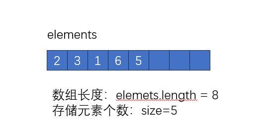
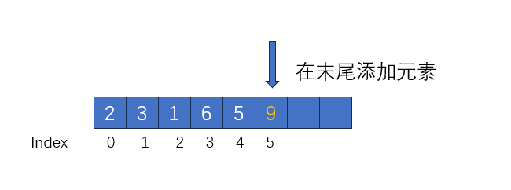
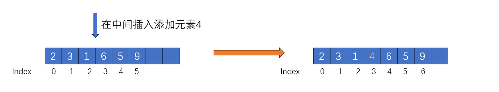
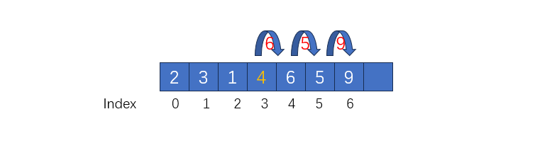
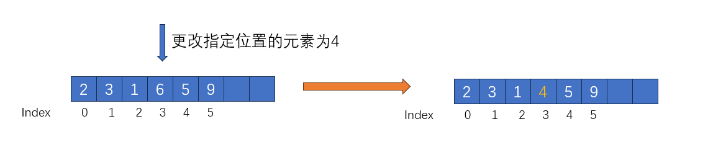
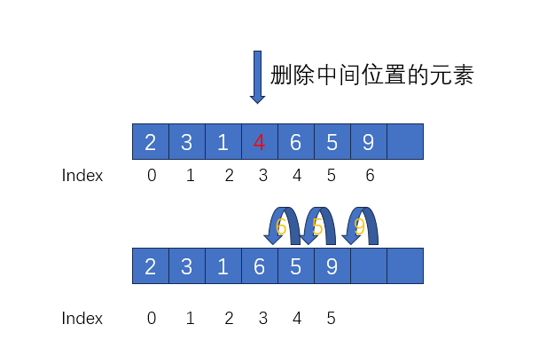

# 动态数组详解及Java实现

​	

[TOC]


## 相关概念

​	动态数组是数据结构中相当常用的一种数据结构；在java中，普通数组长度在声明时就需要固定数组长度且后面无法再更改，如果在无法确定元素的数量的情况下，很难确定数组的长度大小，如果设置过小，无法满足使用的要求，而如果过大，多余的位置不再使用，就会导致内存空间的浪费。	

​	动态数组就是解决这一问题的一种数据结构，虽然它底层依然是由数组实现，但我们在使用的时候可以直接调用接口提供的API，而无需关心它数组长度不够、如何扩容等问题

## 分析

​	我们先简单对需求进行分析，我们现在需要一个可以灵活改变长度的集合，那么首先，我们内部需要一个存储元素的对象，我们可以用常规数组来存储添加的元素；然后我们自然需要知道数组的大小长度，以及数组已存储元素的个数；

我们可以先设计出动态数组的基础属性

```java
public class MyDynamicList<E>{
	//存储的数据元素
    E[] elements;
	//保存的数据个数，初始为0
    int size = 0;
}
```



数组常规的操作，无非就是添加数据、删除数据、查找数据、修改数据等；

所有我们设计的API接口应该至少有与这四种操作相关的方法；

```java
package com.hazards.inter;

public interface DynamicListInter<E> {

    /**
     * 增加一个元素到最后
     * @param e
     */
    void add(E e);

    /**
     * 移除一个元素
     * @param e
     */
    void remove(E e);

    /**
     * 移除指定下表的元素
     * @param index
     */
    void remove(int index);

    /**
     * 增加一个元素到指定下标位置
     * @param index
     * @param e
     */
    void add(int index, E e);

    /**
     * 更新一个下表位置的元素
     * @param index
     * @param e
     */
    void set(int index, E e);

    /**
     * 获取指定索引下表的元素
     * @param index
     * @return
     */
    E get(int index);

}
```

## 实现

### 1.增加

思路：当我们新增元素时，需要考虑以下的情况：

1.增加的数据位置是否合法？

2.数据数据内部的数组大小是否够用？

在知道这些情况后，我们就可以对其做针对性的处理，即在添加时，对索引进行合法性校验；对数据大小进行校验，判断是否满足容量需求，不满足，则需要进行扩容操作——创建一个容量更大的新数组，并将原数组的元素按照顺序依次添加到新数组；

```java
/**
 * 容量需求校验
 * @param minCapacity 最小需要的容量
 */
private void ensureCapacity(int minCapacity) {
    int oldCapacity = elements.length;
    if(oldCapacity > minCapacity){
        //原有容量大于所需容量，无需扩容
        return;
    }
    //扩容,变为以前的2倍
    E[] newElements = (E[]) new Object[oldCapacity * 2];
    for (int i = 0; i < elements.length; i++) {
        newElements[i] = elements[i];
    }
}

/**
 * 添加元素的索引合法性校验
 * @param index 索引下标
 */
private void rangeCheckAdd(int index) {
    if(index < 0 || index > size) {
        throw new IndexOutOfBoundsException("Index: " + index + ", Size: " + size);
    }
}
```

这个时候，我们已经完成添加元素前的校验工作，那么我们如何添加元素呢？这里我们需要分情况讨论；

1.如果添加到元素末尾：如果添加到元素末尾，我们只需要在数组末尾添加元素即可（此时下标索引=size），而其他元素没有变化；



2.如果添加到元素数组中间



如图所示，当我们在数组中间添加元素时，当前所有位置index=3的元素，应该变为新添加的元素，而添加元素后面的元素（index>3）以此往后推。

这里我们需要注意一个前提，**常规数组的结构创建时就固定了的**，所以我们无法在数组中间直接插入一块数据，而是应该改变插入位置的元素的值，并将后续位置的元素依次右移一位；



```java
/**
 * 添加元素
 * @param e 元素
 * @param index 索引
 */
public void add(int index,E e) {
    rangeCheckAdd(index);
    ensureCapacity(size+1);
    for (int i = size; i > index; i--) {
        elements[i] = elements[i - 1];
    }
    elements[index] = e;
    size++;
}
```


> 注意：应该先右移，再更新插入位置上的元素，否则可能会丢失位置上原来的数据

### 2.更新

更新指定位置的数据比较简单，因为数据数量没有变化，所以我们无需担心扩容问题，也不会影响其他位置的元素



```java
/**
* 更新指定位置的与元素
* @param index
* @param e
*/
public void set(int index, E e) {
    rangeCheck(index);
    elements[index] = e;
}
```

### 3.查找

查找比较简答，因为数组是一块连续的内存，而每个元素的下表都已经固定，所以我们只需要校验一下索引的合法性，然后直接获取即可

```java
    /**
     * 获取元素
     * @param index 索引
     * @return 元素
     */
    public E get(int index) {
        //如果索引比数组的容量大，抛出异常
        rangeCheck(index);
        return elements[index];
    }
```

### 4.删除

删除元素和增加的情况有些类型，如果只是删除末尾的元素，直接将末尾的元素去掉即可；

需要注意的是删除中间元素的情况，与增加后移不同，中间元素删除后会留下空白，这个时候需要将后面的元素依次向前移动一位；



```java
    /**
     * 删除元素
     * @param e
     */
    public void remove(int index) {
        rangeCheck(index);
        for (int i = index+1; i < size; i++) {
            elements[i-1] = elements[i];
        }
        elements[--size] = null;
    }
```

> 补充：java的API中已经实现了数组的复制，System.arraycopy，这里为了让大家更好的体会动态数组的原理，才使用常规的for循环实现

## 复杂度总结

我们分析并完成了动态数组的基本操作，我们可以发现，动态数组由于底层实现是常规数组对象，数据存储在一块连续的内存中，所以它的查找效率同样很高——O(1)；但在添加和删除元素的时候，由于涉及到可能出线扩容，已经元素移动的情况，最坏的情况，可能会将元素从头到尾遍历一遍，所以它的时间复杂度为O(n);

## 完整代码

```java
package com.hazards.domain;

import com.hazards.inter.DynamicListInter;

public class MyDynamicList<E> implements DynamicListInter<E> {

    E[] elements;
    int size = 0;


    private static final int DEFAULT_CAPACITY = 10;

    /**
     * 默认长度
     */
    public MyDynamicList() {
        this(DEFAULT_CAPACITY);
    }

    /**
     * 初始花动态数组长度
     * @param size 指定长度
     */
    public MyDynamicList(int size) {
        if(size <=0){
            throw new IllegalArgumentException("Size must be greater than 0");
        }
        elements = (E[]) new Object[size];
    }


    public int size() {
        return this.size;
    }


    /**
     * 添加元素
     * @param e 元素
     */
    public void add(E e) {
        ensureCapacity(size+1);
        elements[size++] = e;
    }


    /**
     * 添加元素
     * @param e 元素
     * @param index 索引
     */
    public void add(int index,E e) {
        rangeCheckAdd(index);
        ensureCapacity(size+1);
        for (int i = size; i > index; i--) {
            elements[i] = elements[i - 1];
        }
        elements[index] = e;
        size++;
    }

    /**
     * 容量需求
     * @param minCapacity
     */
    private void ensureCapacity(int minCapacity) {
        int oldCapacity = elements.length;
        if(oldCapacity > minCapacity){
            //原有容量大于所需容量，无需扩容
            return;
        }
        //扩容,变为以前的1.5倍
        E[] newElements = (E[]) new Object[oldCapacity>>1];
        System.arraycopy(elements, 0, newElements, 0, elements.length);
    }
    /**
     * 删除元素
     * @param e
     */
    public void remove(E e) {
        //判断数组容量进行缩容
        int index = getIndex(e);
        if(index == -1) {
            return;
        }
        rangeCheck(index);
        for (int i = index+1; i < size; i++) {
            elements[i-1] = elements[i];
        }
        elements[--size] = null;
    }


    public void remove(int index) {
        rangeCheck(index);
        for (int i = index+1; i < size; i++) {
            elements[i-1] = elements[i];
        }
        elements[--size] = null;
    }

    /**
     * 更新指定位置的与元素
     * @param index
     * @param e
     */
    @Override
    public void set(int index, E e) {
        rangeCheck(index);
        elements[index] = e;
    }

    private void rangeCheck(int index) {
        if(index < 0 || index >= size) {
            throw new IndexOutOfBoundsException("Index: " + index + ", Size: " + size);
        }
    }

    /**
     * 添加元素的索引合法性校验
     * @param index
     */
    private void rangeCheckAdd(int index) {
        if(index < 0 || index > size) {
            throw new IndexOutOfBoundsException("Index: " + index + ", Size: " + size);
        }
    }

    /**
     * 获取元素
     * @param index 索引
     * @return 元素
     */
    public E get(int index) {
        //如果索引比数组的容量大，抛出异常
        rangeCheck(index);
        return elements[index];
    }

    /**
     * 获取指定元素的索引
     * @param element 指定
     * @return 元素索引
     */
    private int getIndex(E element) {
        //遍历查找元素
        for (int i = 0; i < size; i++) {
            if(elements[i].equals(element)) {
                return i;
            }
        }
        //如果没找打元素，直接返回-1
        return -1;
    }
}

```

**最后**：此篇博客为个人学习总结，有着不少个人理解的东西，可能有着错误或者表述不清的地方，希望大家多多指正和沟通，感谢大家！