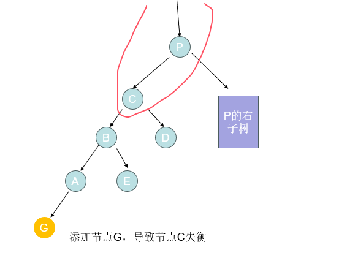
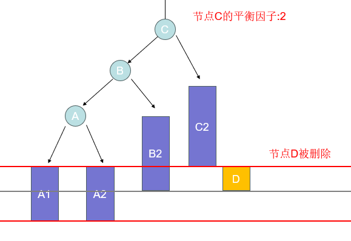
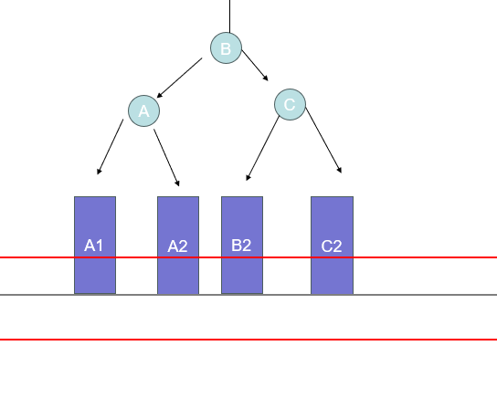

# (数据结构)AVL 详解


[TOC]


## 1.前言

​	我们已经知道，二叉搜索树已经在二叉树的基础上增加了排序，这样的设计可以让我们在遍历二叉树的时候，可以通过对当前结点元素大小的判断，来选择左右子树的遍历方向，而避免了性能消耗在不会存在结果的子树上，可以提高我们的遍历速度。在**理想情况**下，与常规的链表相比，时间复杂度由链表的O(n)优化到了O(logn)。


### 思考

如果我们使用二叉搜索树的目的是提升元素遍历的效率，那么目前的二叉搜索树是否存在问题？什么情况下会出现问题？怎么解决？

### 试验

我们对同一组元素，按照不同顺序添加到二叉搜索树中

1.添加顺序:[4,2,6,1,3,5]


2.[1,2,3,4,5,6]


### 结论

我们可以看到对同一组数据，按照不同顺序添加到二叉树后，树的结构有着明显的不同，甚至在最坏的情况下，二叉树已经和链表没有什么区别了，它的时间复杂度退化成成了O(n)

所以，二叉搜索树添加数据时，并不总是处于理想状态下，最坏的情况可能会退化成链表。

### 分析

**原因**：因为二叉搜索树每次添加新元素的时候，是根据已有结点进行大小判断，确定位置后添加，所以如果一开始就把最小的结点添加进去，那么后续的元素都不会添加到根结点的左子树当中，这样就会导致后续的元素只会添加到已有元素的右子树中，到最后，所有元素的结点只有右结点存储了数据，这样的结果显然是我们不愿意看到的。

> 我们理想的情况应该是，每一颗二叉搜索树的根结点是所有元素的中位数，这样才能使高度和左右子树的元素个数趋近于平衡，降低树的高度，避免单一方向地添加元素，使其退化为链表。
>
> 我们显然无法控制添加元素的顺序，所以我们只能想办法，**在数据元素有变化的时候(添加新元素或者删除元素)的时候，调整已有的存储结构，实现一个自平衡的效果**。
>
> 能够实现这样一种功能的二叉搜索树，就是平衡二叉搜索树，**他通过自平衡，避免了上述二叉搜索树的弊端**。


## 2.AVL树的相关概念

AVL树全称是自平衡二叉搜索树，与二叉搜索树不同的是，他实现了自平衡的功能。为了更好地理解自平衡的概念，我们首先来了解一个重要的概念——**平衡因子**。

### 平衡因子

平衡因子简单来说，就是某个结点的左子树的高度与右子树高度的差：	**结点的平衡因子= 左子树的高度 - 右子树的高度**


可以很明显的发现，但平衡某个节点的平衡因子大于等于2的时候，就已经影响了二叉树的遍历性能。

### AVL树的特点

所以我们可以这样定义二叉树，对于任一节点的平衡因子，他的绝对值都小于等于1（-1、0、1）。

当二叉搜索树地元素个数发生变化后，导致某个或者多个节点的平衡因子改变，使其绝对值大于等于了2，这种现象我们称之为**失衡**。

上文已所说，AVL有着自平衡的特点，在失衡的情况，会对元素的结构或位置进行调整，使其重新归于平衡，如下图：


经过调整后，这颗二叉树以及趋于理想的情况（每个节点的平衡因子都是0——即满足绝对值小于等于1的条件），但这只是一个简单的例子，帮助大家理解失衡以及自平衡的效果，具体怎么实现，我们还要考虑具体的方式。

## 3.二叉搜索树的失衡

我们已经明确地知道，只有在AVL树的元素个数发生变化时，才会导致失衡。那么我们分开讨论这两种情况。

**节点的代码定义**

```java
public class AVLNode<E> {
    E element; //元素
    int height; //节点高度
    AVLNode<E> left; //左子节点
    AVLNode<E> right; //右子节点
    AVLNode<E> parent; //父节点
}
```


### 添加元素造成的失**衡**

#### **添加元素失衡的特点**

我们先分析一下添加元素导致的失衡的情况，因为添加元素导致的失衡，只可能是添加元素的节点的祖先节点的左右子树高度差发生变化并且差值的绝对值大于了1，所有失衡只可能出线在最深的叶子节点添加元素时发生，那么拥有该节点的所有祖先节点的高度都会发生变化，所以我们可以知道，**添加造成的元素时有可能导致所有祖先节点的失衡**，如下图所示：



说明，添加元素G后，首先向父节点遍历，发生节点C发生了失衡，C的左子树高度+1，导致平衡因子+1导致了失衡，但我们又发现C的左子树是C节点高度最高的子树，那么节点C的高度也+1；此时C作为节点P的左节点，P节点的左子树高度也跟着+1，P的高度也发生变化随即失衡；以此类推，P的父节点也可能高度发生变化，导致最后失衡。

总的来说，添加元素造成的失衡，就是因为某个节点的子树高度增加导致的失衡。


> **示例图说明**
>
> 蓝色长方形表示一颗**子树**（比如A1表示节点A的左子树，A2表示节点A的右子树，节点B、C同理）；
>
> 红色的线表示最高高度的线，如果有节点超过了该线，则代表该树失衡；
>
> 两条线之间代表一个节点的高度

#### 1.LL-右旋转（单旋）

第一种情况，添加元素后，某个二叉树的结构为图所示（**C可能是根节点，也可能只是非根节点**）


在这张图，节点C的平衡因子为1(左子树的高度比右子树高1），这个时候我们向左子树添加一个元素时，即会造成失衡，如下图：


如上图所示，当我们在子树A1上添加元素后，C的左子树高度+1，平衡因子也发生改变，变成了2，此时节点C已经失去平衡。

现在为了保持平衡，我们需要对该树的结构进行调整， 针对上图这种情况，我们可以通过**右旋**来改变树的结构，来达到平衡的效果。


对于右旋，我们做了以下操作：

1、改变了B节点的右节点，使其指向C节点；

2、改变了C节点的左节点指向，使其指向B的右子树；

3、使B成为其根节点；

4、更新B的父节点和C的父节点；

如图所示，观察A、B、C三个节点的位置，他们的层级都发生了变化，类似与发生向右旋转的效果，所以我们称之为右旋转；

我们可以看到，当对该树进行了右旋转的操作，该树已经由失衡状态变成了平衡状态。

**总结**：对于添加元素发生在失衡节点的左子节点（Left）的左子节点（Left）的子树的情况，我们简称为LL，我们可以通过对失衡节点进行右旋转来完成自平衡的效果。

#### 2.LR-左旋转后再右旋转（双旋）

我们再看第二种情况


这个情况和LL不同的是，添加元素发生再根节点C的左子节点（Left）的右子节点（Right），这种情况简称为LR

针对这种情况，如果，右旋转显然无法达到平衡的效果，所以我们需要先对节点B进行左旋转，结果如下图：


左旋操作步骤为

1、改变根节点左子节点指向，使其指向A；

2、改变节点B的右子节点指向，使其指向A的左子树；

3、改变节点A的左子节点指向，使其指向B；

我们可以发现，再对接节点B进行左旋转后，C的平衡因子依然为2，说明该树依然是不平衡的状态，但却变成之前我们所见的LL的情况，所以，我们这个失衡再对其进行右旋转，即可达到平衡的效果:


此步骤和LL右旋转完全一致，该处不再赘述。

#### 3.RR-左旋转以及RL-右旋转后再左旋转

该两种情况与LL和LR原理完全相同，只是方向不同，这里不再赘述。

#### 添加元素平衡调整的时间复杂度

无论是LL、RR、LR、RL那种情况，我们都可以通过找到高度最低的失衡节点，然后操作其子节点和孙子节点，进行旋转达到自平衡的效果，在这个过程中，调整后的子树高度并没有发生变化（均在红线以上），所以，其父节点无需担心失衡的问题。

因此，调整的次数是可见的，时间复杂度为O(1)

### 删除元素导致的失衡

#### 删除元素失衡的特点

另一种情况是删除导致的失衡，其实在我们讨论的添加元素导致的失衡LL、LR、RL、RR四种情况，已经包含了所有失衡的情况，都可以通过左旋或者右旋的方式达到平衡。所以这里我们不再过多介绍自平衡的操作。

**我们需要注意的是旋转平衡后的情况**，删除节点再实现平衡后的情况有些不同；我们已经知道添加元素后的失衡，是由于某个子树的高度发生增加，我们可以通过旋转的操作，减少了高度，操作后的节点高度并没有发生变化。

但是删除节点，并不会增加子树的高度，它会减少某一颗子树的高度，从而增加导致平衡因子的增加，使节点失衡。



如上图，在元素添加导致的失衡中，我们是往C的左子树的叶子节点添加元素，使其左子树高度+1，最后是平衡因子+1，造成了失衡；但这次我们删除了C的右子树的某个节点，导致右子树的高度-1，同样是平衡因子+1，并造成了失衡；但是注意，该颗子树的根节点C的高度，并没有发生任何变化。

现在我们对其进行旋转操作，使其平衡



我们发现，虽然我们可以通过旋转使其恢复平衡，**但是**，这颗二叉树的高度却发生了变化——高度-1；我们可以以此类推，B的父节点的高度也可能-1，那么B的父节点依然存在失衡的风险；

与添加元素造成的失衡，AVL树平衡过后高度不变，所以无需担心父节点的失衡不同。删除的操作，即使对其进行平衡操作后，还需要担心父节点是否失衡，所以，**我们需要不断对父节点进行遍历和旋转平衡操作，最坏的情况可能会一直遍历到整个二叉树的根节点**

#### 删除元素平衡调整的时间复杂度

因为我们需要对失衡的节点不断遍历其父节点（判断是否失衡并进行平衡操作），所以删除的负责度是O(logn)

## 4.AVL树的性能分析

### 1.搜索

因为AVL树是一颗自平衡的二叉搜索树，它的某个节点的平衡因子的绝对值都小于1，所以它的搜索性能可以稳定达到二叉树搜索最理想的情况；

时间复杂度为O(logn)

### 2.添加元素

添加元素时，首先需要遍历，时间复杂度为O(logn)，但是由于添加元素可能导致的失衡，需要进行自平衡的操作，我们还需要进行O(1)次旋转

即O(logn) + O(1)

### 3.删除元素

添加元素时，同样需要遍历，时间复杂度为O(logn)，删除元素的导致失衡，除了对最低高度的失衡节点进行旋转平衡操作外，还需要对其父节点遍历，直到整个二叉树的根节点，这种情况我们至多需要进行O(logn)次旋转

即O(logn) + O(logn)

### 4.总结

其实我们可以发现，AVL是一颗绝对平衡的二叉搜索树，它的所有节点的平衡因子，即左右子树高度差的绝对值都不会大于1，而我们在添加元素或删除元素时所做一些旋转操作，都是为了维持二叉树的平衡，然而旋转操作相比于常规的二叉搜索树的添加和删除，是消耗了更多的性能，这也是AVL的缺点。

所以，我们可以得出，AVL树最理想的使用场景，是用于查找元素，而非频繁操作元素的情况下。

综合来说，搜索操作比较频繁，但数据却很少变化的情况下，我们可以考虑使用AVL树；而如果数据经常变化，AVL将会消耗大量的性能，这种情况使用AVL树就不太合适。


## 5.完整代码实现

```java
package hazards.domain.tree.avl;

import java.util.Comparator;

/**
 * AVL树示例
 */
public class AVLTree<E>  {


    protected AVLNode<E> root;

    protected int size;

    protected Comparator<E> comparator;


    protected void afterAdd(AVLNode<E> node) {
        //如果节点为null
        if (node == null) {
            return;
        }
        while ((node = node.parent) != null) {
            if (isBalanced(node)) {
                //该节点是平衡树根节点
                updateHeight(node);
            } else {
                //恢复平衡
                rebalanced(node);
                break;
            }
        }
    }

    public void remove(E element){
        AVLNode<E> node = node(element);

        if(node.left!=null&&node.right!=null){
            AVLNode<E> prev = successor(node);
            node.element = prev.element;
            node = prev;
        }

        AVLNode<E> replaceNode = node.left != null ? node.left : node.right;
        if(replaceNode!=null){
            replaceNode.parent = node.parent;
            if(node.parent==null){
                root = replaceNode;
            }else if(node.parent.left==node){
                node.parent.left = replaceNode;
            }else {
                node.parent.right = replaceNode;
            }
        }else if(node.parent==null){
            root = null;
        }else{
            if(node.parent.left==node){
                node.parent.left = null;
            }else {
                node.parent.right=  null;
            }
        }

        //删除后的逻辑处理
        afterRemove(node);

    }

    /**
     * 删除节点后是否平衡
     * @param node
     */
    protected void afterRemove(AVLNode<E> node) {
        if(node == null) {
            return;
        }

        while ((node = node.parent) != null) {
            if (isBalanced(node)) {
                updateHeight(node);
            }else {
                rebalanced(node);
            }
        }
    }

    /**
     * 更新指定节点的高度
     *
     * @param node 指定节点-高度最低的不平衡节点
     */
    private void updateHeight(AVLNode<E> node) {
        node.updateHeight();
    }

    /**
     * 恢复平衡
     *
     * @param grandNode 指定节点
     */
    private void rebalanced(AVLNode<E> grandNode) {
        AVLNode<E> parNode = grandNode.tallerChildNode();
        AVLNode<E> node = parNode.tallerChildNode();
        if (parNode.isLeftChild()) {
            //L
            if (node.isLeftChild()) {
                //LL
                rotateRight(grandNode);
            } else {
                //LR
                rotateLeft(parNode);
                rotateRight(grandNode);
            }
        } else {
            //R
            if (node.isLeftChild()) {
                //RL
                rotateRight(parNode);
                rotateLeft(grandNode);
            } else {
                //RR
                rotateLeft(grandNode);
            }
        }
    }


    private AVLNode<E> node(E element){
        if (element==null) return null;

        AVLNode<E> curNode = this.root;
        while (curNode!=null){
            int cmp = compare(curNode.element, element);
            if(cmp==0){
                return curNode;
            }else if(cmp>0){
                curNode = curNode.left;
            }else {
                curNode = curNode.right;
            }
        }

        return null;
    }


    /**
     * 对指定节点进行左旋转
     *
     * @param node 指定节点
     */
    private void rotateLeft(AVLNode<E> node) {
        AVLNode<E> childNode = node.right;
        AVLNode<E> grandSonNode = childNode.left;
        //更新当前节点和直接子节点的关系
        node.right = grandSonNode;
        childNode.left = node;

        //对各个节点的关系进行更新
        afterRotate(node,childNode,grandSonNode);

    }

    /**
     * 对指定节点进行右旋转
     *
     * @param node 指定节点
     */
    private void rotateRight(AVLNode<E> node) {
        AVLNode<E> childNode = node.left;
        AVLNode<E> grandSonNode = childNode.right;
        //更新当前节点与直接子节点的关系
        node.left = grandSonNode;
        childNode.right = node;
        //对各个节点的关系进行更新
        afterRotate(node,childNode,grandSonNode);
    }

    private void afterRotate(AVLNode<E> grandNode,AVLNode<E> parentNode,AVLNode<E> childNode) {
        //更新当前子树的根节点
        if (grandNode.isLeftChild()) {
            grandNode.parent.left = parentNode;
        } else if(grandNode.isRightChild()){
            grandNode.parent.right = parentNode;
        }else {
            root = parentNode;
        }
        parentNode.parent = grandNode.parent;
        //更新父节点
        if(childNode != null){
            childNode.parent = grandNode;
        }
        grandNode.parent = parentNode;
        //更新高度
        updateHeight(grandNode);
        updateHeight(parentNode);
    }

    private void elementCheck(E element) {
        if (element == null) {
            throw new IllegalArgumentException("element not allow be null!");
        }
    }

    public void add(E element) {
        elementCheck(element);
        //第一次添加
        if (root == null) {
            root = new AVLNode<>(element, null);
            size++;
            return;
        }
        //找到父节点
        AVLNode<E> node = this.root;
        AVLNode<E> parentNode = null;
        int cmp = 0;
        while (node != null) {
            cmp = compare(node.element, element);
            parentNode = node;
            if (cmp > 0) {
                node = node.left;
            } else if (cmp < 0) {
                node = node.right;
            } else {
                return;
            }
        }
        //将新节点放入子节点中
        AVLNode<E> newNode = new AVLNode<>(element, parentNode);
        if (cmp > 0) {
            parentNode.left = newNode;
        } else {
            parentNode.right = newNode;
        }

        //添加节点的后续操作
        afterAdd(newNode);
    }


    private int compare(E element1, E element2) {
        if (comparator != null) {
            return comparator.compare(element1, element2);
        }
        return ((Comparable) element1).compareTo(element2);
    }

    /**
     * AVL内部节点对象
     *
     * @param <E> 范型
     */
    private static class AVLNode<E>{

        //高度，默认为1，添加的时候为叶子节点
        int height = 1;
        public E element;
        public AVLNode<E> left;
        public AVLNode<E> right;
        public AVLNode<E> parent;

        public AVLNode(E element, AVLNode<E> parentNode) {
            this.element = element;
            this.parent = parentNode;
        }

        /**
         * 获取平衡因子
         *
         * @return 平衡因子
         */
        public int balanceFactor() {
            int leftHeight = left == null ? 0 :  left.height;
            int rightHeight = right == null ? 0 : right.height;
            return leftHeight - rightHeight;
        }

        public void updateHeight() {
            int leftHeight = left == null ? 0 : left.height;
            int rightHeight = right == null ? 0 : right.height;
            this.height = Math.max(leftHeight, rightHeight) + 1;
        }


        public AVLNode<E> tallerChildNode() {
            int leftHeight = left == null ? 0 :  left.height;
            int rightHeight = right == null ? 0 : right.height;
            if (leftHeight > rightHeight) {
                return left;
            }
            if (leftHeight < rightHeight) {
                return right;
            }
            return isLeftChild() ? left : right;
        }

        public boolean isLeftChild() {
            return parent!=null && parent.left==this;
        }

        public boolean isRightChild() {
            return parent!=null && parent.right==this;
        }

        @Override
        public String toString() {
            return element.toString();
        }
    }


    /**
     * 獲取後驅節點
     *
     * @param node 當前節點
     * @return 後驅節點
     */
    private AVLNode<E> successor(AVLNode<E> node) {
        if (node == null) return null;


        if (node.right != null) {
            node = node.right;
            while (node.left != null) {
                node = node.left;
            }
            return node;
        }

        while (node.parent != null && node != node.parent.left) {
            node = node.parent;
        }

        return node.parent;
    }

    /**
     * 当前节点是否平衡
     *
     * @param node 节点
     * @return 是否平衡
     */
    private boolean isBalanced(AVLNode<E> node) {
        return Math.abs(node.balanceFactor()) <= 1;
    }
}
```

