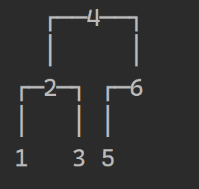
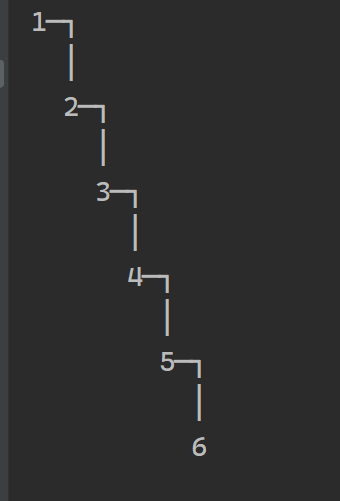
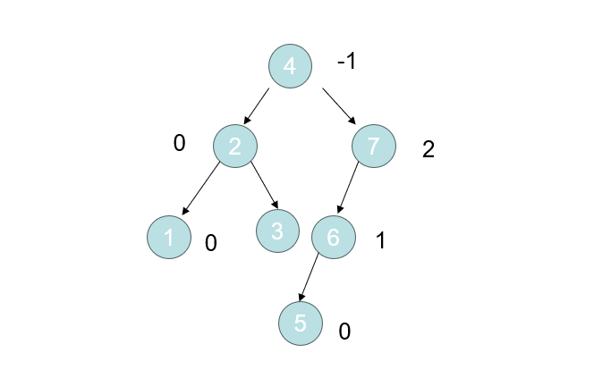
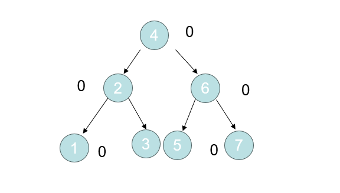
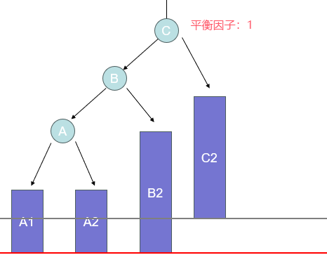
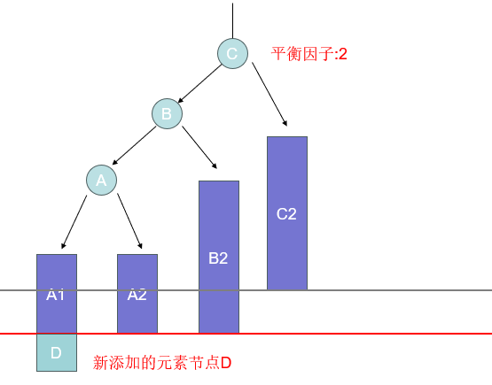
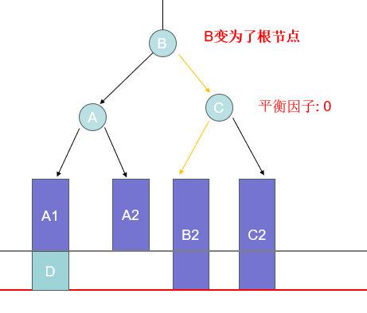
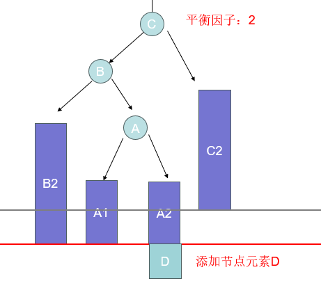
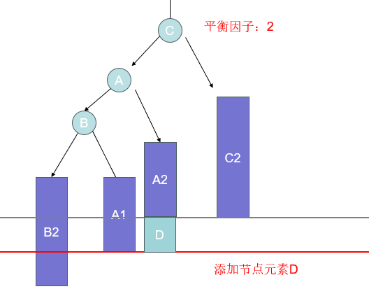
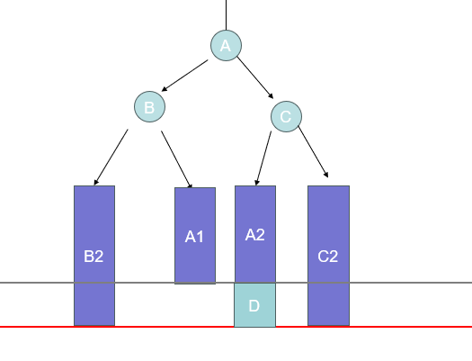

# (数据结构)AVL 详解


## 1.前言

​	我们已经知道，二叉搜索树已经在二叉树的基础上增加了排序，这样的设计可以让我们在遍历二叉树的时候，可以通过对当前结点元素大小的判断，来选择左右子树的遍历方向，而避免了性能消耗在不会存在结果的子树上，可以提高我们的遍历速度。在**理想情况**下，与常规的链表相比，时间复杂度由链表的O(n)优化到了O(logn)。


### 思考

如果我们使用二叉搜索树的目的是提升元素遍历的效率，那么目前的二叉搜索树是否存在问题？什么情况下会出现问题？怎么解决？

### 试验

我们对同一组元素，按照不同顺序添加到二叉搜索树中

1.添加顺序:[4,2,6,1,3,5]



2.[1,2,3,4,5,6]



### 结论

我们可以看到对同一组数据，按照不同顺序添加到二叉树后，树的结构有着明显的不同，甚至在最坏的情况下，二叉树已经和链表没有什么区别了，它的时间复杂度退化成成了O(n)

所以，二叉搜索树添加数据时，并不总是处于理想状态下，最坏的情况可能会退化成链表。

### 分析

**原因**：因为二叉搜索树每次添加新元素的时候，是根据已有结点进行大小判断，确定位置后添加，所以如果一开始就把最小的结点添加进去，那么后续的元素都不会添加到根结点的左子树当中，这样就会导致后续的元素只会添加到已有元素的右子树中，到最后，所有元素的结点只有右结点存储了数据，这样的结果显然是我们不愿意看到的。

> 我们理想的情况应该是，每一颗二叉搜索树的根结点是所有元素的中位数，这样才能使高度和左右子树的元素个数趋近于平衡，降低树的高度，避免单一方向地添加元素，使其退化为链表。
>
> 我们显然无法控制添加元素的顺序，所以我们只能想办法，**在数据元素有变化的时候(添加新元素或者删除元素)的时候，调整已有的存储结构，实现一个自平衡的效果**。
>
> 能够实现这样一种功能的二叉搜索树，就是平衡二叉搜索树，**他通过自平衡，避免了上述二叉搜索树的弊端**。


## 2.AVL树的相关概念

AVL树全称是自平衡二叉搜索树，与二叉搜索树不同的是，他实现了自平衡的功能。为了更好地理解自平衡的概念，我们首先来了解一个重要的概念——**平衡因子**。

### 平衡因子

平衡因子简单来说，就是某个结点的左子树的高度与右子树高度的差：	**结点的平衡因子= 左子树的高度 - 右子树的高度**



可以很明显的发现，但平衡某个节点的平衡因子大于等于2的时候，就已经影响了二叉树的遍历性能。

### AVL树的特点

所以我们可以这样定义二叉树，对于任一节点的平衡因子，他的绝对值都小于等于1（-1、0、1）。

当二叉搜索树地元素个数发生变化后，导致某个或者多个节点的平衡因子改变，使其绝对值大于等于了2，这种现象我们称之为**失衡**。

上文已所说，AVL有着自平衡的特点，在失衡的情况，会对元素的结构或位置进行调整，使其重新归于平衡，如下图：



经过调整后，这颗二叉树以及趋于理想的情况（每个节点的平衡因子都是0——即满足绝对值小于等于1的条件），但这只是一个简单的例子，帮助大家理解失衡以及自平衡的效果，具体怎么实现，我们还要考虑具体的方式。

## 3.二叉搜索树的失衡

我们已经明确地知道，只有在AVL树的元素个数发生变化时，才会导致失衡。那么我们分开讨论这两种情况。

**节点的代码定义**

```java
public class AVLNode<E> {
    E element; //元素
    int height; //节点高度
    AVLNode<E> left; //左子节点
    AVLNode<E> right; //右子节点
    AVLNode<E> parent; //父节点
}
```


### 添加元素造成的失衡

> **示例图说明**
>
> 蓝色长方形表示一颗子树（比如A1表示节点A的左子树，A2表示节点A的右子树，节点B、C同理）；
>
> 红色的线表示最高高度的线，如果有节点超过了该线，则代表该树失衡；
>
> 两条线之间代表一个节点的高度

#### 1.LL-右旋转（单旋）

第一种情况，添加元素后，某个二叉树的结构为图所示（C可能是根节点，也可能只是非根节点）



在这张图，节点C的平衡因子为1(左子树的高度比右子树高1），这个时候我们向左子树添加一个元素时，即会造成失衡，如下图：



如上图所示，当我们在子树A1上添加元素后，C的左子树高度+1，平衡因子也发生改变，变成了2，此时节点C已经失去平衡。

现在为了保持平衡，我们需要对该树的结构进行调整， 针对上图这种情况，我们可以通过**右旋**来改变树的结构，来达到平衡的效果。



对于右旋，我们做了以下操作：

1、改变了B节点的右节点，使其指向C节点；

2、改变了C节点的左节点指向，使其指向B的右子树；

3、使B成为其根节点；

4、更新B的父节点和C的父节点；

如图所示，观察A、B、C三个节点的位置，他们的层级都发生了变化，类似与发生向右旋转的效果，所以我们称之为右旋转；

我们可以看到，当对该树进行了右旋转的操作，该树已经由失衡状态变成了平衡状态。

**总结**：对于添加元素发生在失衡节点的左子节点（Left）的左子节点（Left）的子树的情况，我们简称为LL，我们可以通过对失衡节点进行右旋转来完成自平衡的效果。

#### 2.LR-左旋转后再右旋转（双旋）

我们再看第二种情况




这个情况和LL不同的是，添加元素发生再根节点C的左子节点（Left）的右子节点（Right），这种情况简称为LR

针对这种情况，如果，右旋转显然无法达到平衡的效果，所以我们需要先对节点B进行左旋转，结果如下图：




左旋操作步骤为

1、改变根节点左子节点指向，使其指向A；

2、改变节点B的右子节点指向，使其指向A的左子树；

3、改变节点A的左子节点指向，使其指向B；

我们可以发现，再对接节点B进行左旋转后，C的平衡因子依然为2，说明该树依然是不平衡的状态，但却变成之前我们所见的LL的情况，所以，我们这个失衡再对其进行右旋转，即可达到平衡的效果:



此步骤和LL右旋转完全一致，该处不再赘述。

#### 3.RR-左旋转以及RL-右旋转后再左旋转

该两种情况与LL和LR原理完全相同，只是方向不同，这里不再赘述。

## 4.代码实现


